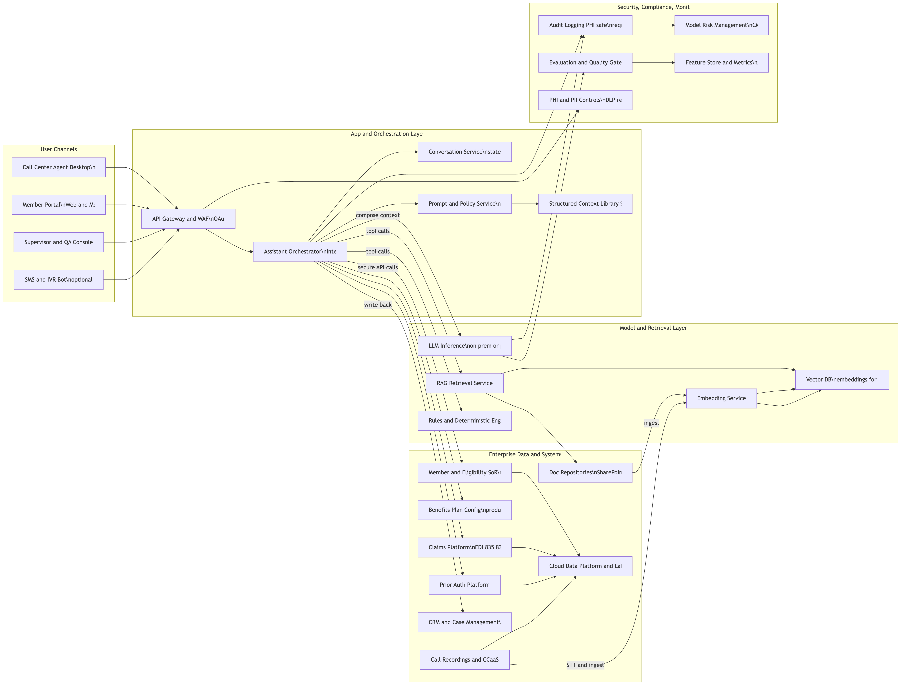
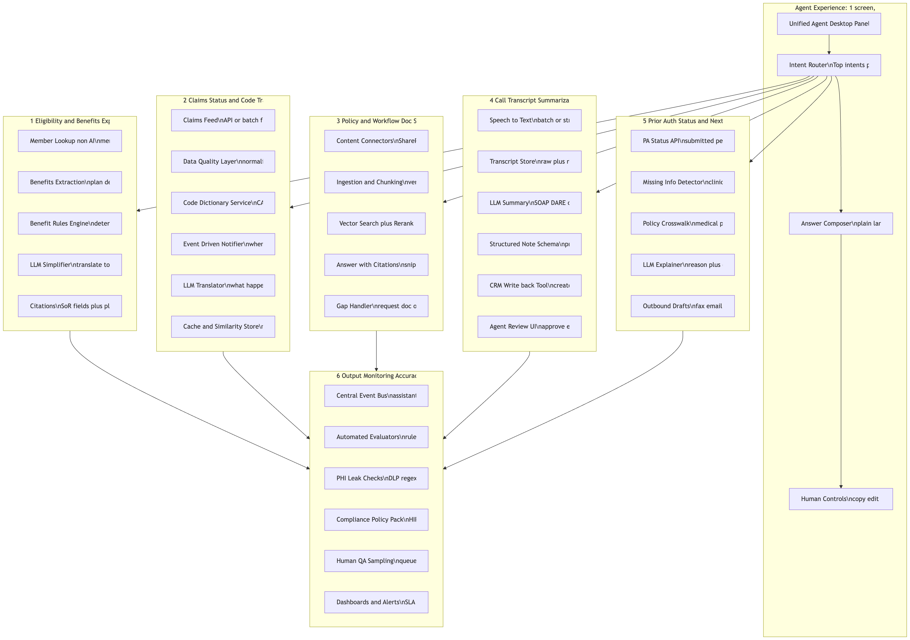

# HCSC-like AI Call Center Assistant (Reference Architecture + Streamlit PoC)

This repo is an **interview-style deliverable** for a national health insurer (HCSC-like):

1. **High-level end-to-end AI call center assistant reference architecture**
2. **"Double-click" logical architecture** covering **6 priority use cases**
3. A **PoC-level working prototype** (dummy data acceptable) implemented as a **Streamlit** app

> PHI/PII note: This repo contains **dummy data only**. The architecture assumes a payer posture where **PHI does not leave payer-controlled environments** (on-prem/private cloud) unless properly de-identified and governed.

---

## Architecture Diagrams (rendered previews)

### 1) High-level AI solution stack

- Source: `ai_solution_stack.mmd`
- Alternate format: `ai_solution_stack.svg`

### 2) Use-case “double-click” logical architecture (6 use cases)

- Source: `use_cases_double_click.mmd`
- Alternate format: `use_cases_double_click.svg`

---

## 6 Use Cases Covered

The architecture and PoC align to these use cases:

1. **Eligibility & benefits explainer** (SoR lookup → plain language explanation)
2. **Claims status + CARC/RARC translation** (status + denial/payment code interpretation)
3. **Policy / workflow doc search with citations** (retrieval over internal docs)
4. **Transcript summarization + CRM note logging** (after-call work reduction)
5. **Prior auth status + next steps / missing info**
6. **Monitoring console** (tone + PHI leak heuristics + citation presence heuristic)

---

## PoC: Streamlit Prototype

The working prototype lives in `./poc`.

### What’s implemented

- **Single Streamlit app** with 6 modes (one per use case)
- **Local JSON dummy datasets** for members/claims/docs/transcripts/prior auth
- **Deterministic “LLM-like” functions** (runs offline; no external model calls)
- **Lightweight retrieval** with citations for the doc search mode
- **Local JSON “CRM store”** write-back for the CRM logging mode

### Run locally (macOS / zsh)

From the repo root:

1) Create and activate a venv:

- `python3 -m venv .venv && source .venv/bin/activate`

2) Install deps:

- `pip install -r poc/requirements.txt`

3) Start Streamlit:

- `streamlit run poc/app.py`

Then open: `http://localhost:8501`

---

## Repo Layout

- `README.md` (this file)
- `ai_solution_stack.mmd` / `.png` / `.svg`
- `use_cases_double_click.mmd` / `.png` / `.svg`
- `poc/`
  - `app.py` (Streamlit UI)
  - `src/` (services + monitoring)
  - `data/` (dummy JSON)

---

## Design Notes (interview discussion points)

- **Private LLM posture**: assume on-prem or private endpoint LLM inference; avoid sending PHI to public SaaS.
- **Citations + controls**: agent-facing assistant should be grounded with citations and allow copy/edit/approve.
- **Tool-first architecture**: assistant orchestration routes to deterministic tools (SoR APIs, rules engines) and retrieval.
- **Monitoring**: log outputs/tool calls; apply automated checks (tone/compliance heuristics, PHI leak detection), plus human QA sampling.

---

## Limitations (intentional PoC constraints)

- Not an enterprise deployment; focuses on **reference architecture + runnable demo**.
- Doc retrieval is **prototype-grade** and operates on a tiny local corpus.
- No real STT, CCaaS, SoR integrations, or real governance stack wired in.

---

## Next Steps

- Swap deterministic stub summarizers/translators with a real on-prem/private LLM.
- Add hybrid retrieval (BM25 + vector) + reranking and stronger metadata filtering.
- Integrate real SoR APIs (eligibility/claims/prior auth) and CRM write-back with idempotency.
- Add eval harnesses (golden sets), drift monitoring, and stronger compliance policy enforcement.
